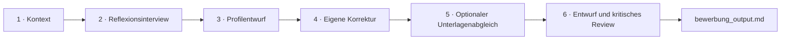

# KI Bewerbungs Coach

Ein interaktives Python-Tool, das konkrete berufliche Erfahrungen in ein validiertes Arbeitsstil-Profil und anschließend in authentische Bewerbungsantworten überführt.

```text
╭─────╮
│◕‿◕│
╰──┬──╯

KI Bewerbungs Coach

Von konkreten Erfahrungen zu einer authentischen Bewerbung.

In sechs Schritten reflektieren wir deine Arbeitsweise,
gleichen sie mit der Zielrolle ab und entwickeln daraus
einen Bewerbungstext, den du selbst prüfen und freigeben kannst.
```

Der Coach schreibt nicht sofort einen möglichst überzeugenden Text. Er fragt zunächst nach konkreten Situationen, verdichtet die Antworten zu einer überprüfbaren Arbeitshypothese und gibt der Person anschließend die Möglichkeit, diese Interpretation zu korrigieren. Erst danach werden Bewerbungsantworten formuliert und kritisch gegengelesen.

> Das Tool ist kein psychologisches Diagnoseinstrument. Die finale inhaltliche Verantwortung und Freigabe liegen immer bei der Person.

## Ablauf



| Schritt | Ergebnis |
|---|---|
| **1 · Kontext** | Aktuelle Rolle, Zielrolle und optional die Stellenausschreibung |
| **2 · Reflexionsinterview** | Konkrete Erfahrungen statt abstrakter Eigenschaftslisten |
| **3 · Profilentwurf** | Arbeitsstil, Zusammenarbeit, Motivation, Stärken und Spannungsfelder |
| **4 · Eigene Korrektur** | Die Person bestätigt, ergänzt oder korrigiert die Interpretation |
| **5 · Optionaler Unterlagenabgleich** | Vergleich mit CV oder Anschreiben sowie der Zielrolle |
| **6 · Finale Antworten** | Erster Entwurf, kritisches Review und überarbeitete Fassung |

## Reifegrad

Der Coach ist ein **CLI-MVP**. Die erste Version wurde bewusst als vertikaler Prototyp in einer Python-Datei entwickelt, um zunächst Interviewablauf, Profilkorrektur und Schreibprozess zu validieren.

Für diese Repository-Version wurden die erkannten Verantwortlichkeiten getrennt:

- Terminaloberfläche und Eingaben,
- Konfiguration,
- Modellprovider und Antwortnormalisierung,
- Prompts,
- Workflow,
- Ergebniserzeugung und Dateiausgabe.

Besonders fehleranfällige, modellunabhängige Bereiche sind mit fokussierten Tests abgesichert. Der Code ist damit nachvollziehbarer und erweiterbarer, bleibt aber bewusst kleiner als eine produktionsreife Plattform.

Für einen produktiven Einsatz wären insbesondere eine Weboberfläche, Sitzungsverwaltung, Zugriffsschutz, ein detailliertes Datenschutzkonzept und eine systematische Evaluation der Interview- und Textqualität erforderlich.

## Projektstruktur

```text
ki-bewerbungs-coach/
├── src/
│   └── ki_bewerbungs_coach/
│       ├── __init__.py
│       ├── __main__.py
│       ├── app.py
│       ├── config.py
│       ├── llm.py
│       ├── output.py
│       ├── prompts.py
│       ├── ui.py
│       └── workflow.py
├── tests/
│   ├── test_llm_response_parsing.py
│   ├── test_output.py
│   └── test_workflow_helpers.py
├── docs/
│   └── konzept.md
├── .env.example
├── .gitignore
├── pyproject.toml
└── README.md
```

### Verantwortlichkeiten

| Modul | Aufgabe |
|---|---|
| `app.py` | Verdrahtet Konfiguration, UI, Provider und Workflow |
| `config.py` | Liest und validiert Umgebungsvariablen |
| `llm.py` | Kapselt Provideraufrufe, Retries und Antwortnormalisierung |
| `prompts.py` | Hält Prompts zentral reviewbar |
| `ui.py` | Enthält ausschließlich Terminaldarstellung und Eingaben |
| `workflow.py` | Orchestriert die sechs fachlichen Phasen |
| `output.py` | Rendert und speichert das Markdown-Ergebnis atomar |

Die Aufteilung soll Verantwortlichkeiten sichtbar machen, ohne für einen kleinen MVP unnötige Frameworks oder Abstraktionsebenen einzuführen.

## Voraussetzungen

- Python **3.11 oder neuer**
- Internetzugang für einen externen Modellprovider oder eine lokale Ollama-Installation
- API-Key des gewählten Providers, sofern kein lokales Modell verwendet wird

## Installation

```bash
git clone <repository-url>
cd <repository-verzeichnis>
python -m venv .venv
```

**Windows PowerShell**

```powershell
.venv\Scripts\Activate.ps1
python -m pip install -e ".[dev]"
```

**macOS / Linux**

```bash
source .venv/bin/activate
python -m pip install -e ".[dev]"
```

## Konfiguration

```bash
cp .env.example .env
```

Beispiel für Anthropic:

```dotenv
MODEL=claude-sonnet-4-6
ANTHROPIC_API_KEY=dein_api_key
MAX_QUESTIONS=12
OUTPUT_FILE=bewerbung_output.md
LLM_EMPTY_RETRIES=1
LLM_RETRY_DELAY_SECONDS=1.0
```

Weitere Beispiele für OpenAI-kompatible Provider, Ollama, Gemini und Azure OpenAI stehen in `.env.example`.

Die `.env`-Datei darf nicht in Git eingecheckt werden.

## Start

Nach der Installation als Paket:

```bash
ki-bewerbungs-coach
```

Alternativ:

```bash
python -m ki_bewerbungs_coach
```

## Bedienung

| Eingabe | Funktion |
|---|---|
| `DONE` oder `FERTIG` | Beendet eine mehrzeilige Eingabe |
| `SKIP` oder `ÜBERSPRINGEN` | Überspringt einen optionalen Schritt |
| `STOP`, `ENDE`, `EXIT` oder `QUIT` | Beendet das Interview vorzeitig |
| `Strg+C` | Bricht das Programm ab |

## Ausgabe

Standardmäßig entsteht `bewerbung_output.md` mit:

1. dem validierten Arbeitsstil-Profil,
2. optional dem Unterlagenabgleich,
3. dem ersten Antwortentwurf,
4. dem kritischen Review und der finalen Fassung.

Die Datei wird atomar ersetzt. Ein Schreibabbruch hinterlässt damit nicht versehentlich ein nur teilweise erzeugtes Ergebnis.

## Fehlerbehandlung bei leeren Modellantworten

Einige Provider oder kompatible Gateways liefern gelegentlich eine technisch erfolgreiche Antwort ohne sichtbaren Text. Der Coach reagiert darauf abgestuft:

1. begrenzter automatischer Retry,
2. kompakterer Review-Prompt,
3. Speichern des vollständigen ersten Entwurfs, falls auch der Fallback leer bleibt.

Diese Logik wurde bewusst in `llm.py` und `workflow.py` getrennt: Der Provider erkennt die leere Antwort; der Workflow entscheidet, welcher fachliche Fallback sinnvoll ist.

## Tests

```bash
pytest
```

Die Tests konzentrieren sich auf Bereiche, die ohne echte API-Aufrufe zuverlässig prüfbar und in der Vergangenheit fehleranfällig waren:

- Normalisierung unterschiedlicher Provider-Antwortformate,
- optionale Abschnitte und atomisches Speichern der Ergebnisdatei,
- Abbruchbefehle, Fertig-Token und Transkriptaufbereitung.

Bewusst nicht enthalten sind Tests, die eine stabile inhaltliche Antwort eines externen Sprachmodells vortäuschen würden.

## Datenschutz und Vertraulichkeit

Abhängig vom gewählten Provider werden Interviewantworten, Bewerbungsunterlagen und Stellenbeschreibung an einen externen Modellanbieter übertragen. Daher sollten keine vertraulichen Projektinformationen, Kundendaten, Geschäftsgeheimnisse oder unnötigen personenbezogenen Daten eingegeben werden.

Für lokale Experimente kann ein Ollama-Modell verwendet werden. Die tatsächliche Vertraulichkeit hängt dennoch von der lokalen Infrastruktur und Konfiguration ab.

## Grenzen

- Das Ergebnis hängt von Modell, Prompt, Gesprächslänge und Eingabequalität ab.
- Das Interview ersetzt keine psychologische Diagnostik.
- Der Coach prüft berufliche Aussagen nicht gegen externe Nachweise.
- Eine Stellenbeschreibung darf das Interview fokussieren, aber keine Eigenschaften erzeugen.
- Die finale Fassung muss vollständig durch die Person geprüft werden.

Weitere Hintergründe stehen unter [`docs/konzept.md`](docs/konzept.md).
